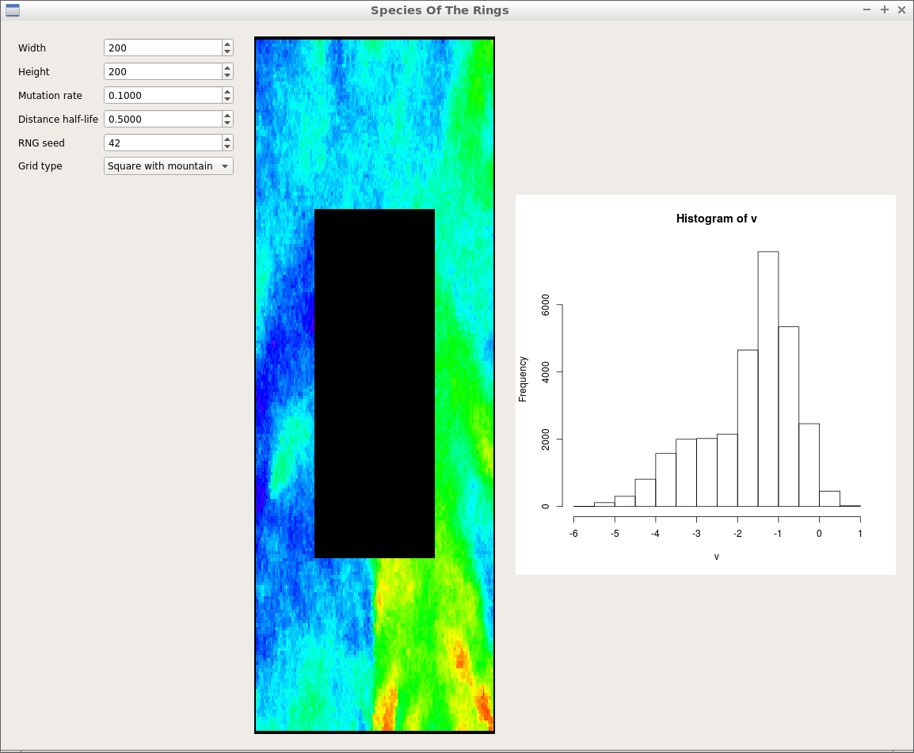

# SpeciesOfTheRings

Branch||
---|---|---
`master`||
`develop`||

Spatial simulation about ring species in C++ using Qt.

## Video's

 * The formation of a ring species: [.ogv](http://richelbilderbeek.nl/SpeciesOfTheRings42.ogv)
